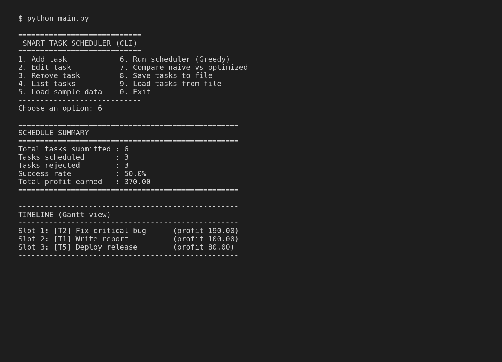

# Smart Task Scheduler

A command-line task scheduler that uses the **Greedy Job Sequencing with
Deadlines** algorithm to select the subset of tasks that maximizes total
profit while respecting each task's deadline.

Built for the VITyarthi "Build Your Own Project" evaluation — Data
Structures & Algorithms.



---

## Overview

Each task has a **deadline** (the latest time slot by which it must be
done) and a **profit** (reward earned if completed on time). Only one
task can occupy a time slot. The scheduler decides which tasks to run,
and in which slot, to earn the maximum possible total profit — a classic
NP-hard-looking problem that has an elegant **O(n log n) greedy
solution** using sorting and a Union-Find (Disjoint Set) data structure.

## Features

- **Task management** — add, edit, remove, and list tasks with full
  input validation.
- **Greedy scheduling engine** — computes the optimal (max-profit)
  schedule; includes both an O(n²) reference implementation and an
  optimized O(n log n) Union-Find implementation.
- **Performance comparison mode** — times both algorithms side-by-side
  on the same data to demonstrate the efficiency gain.
- **Analytics & reporting** — schedule summary, a text-based Gantt
  timeline, success rate, and a breakdown of rejected tasks.
- **Persistence** — save/load task lists to/from JSON (`data/tasks.json`).
- **Logging** — all actions are logged to `data/scheduler.log` (rotating
  file handler) for traceability.
- **Built-in sample dataset** for a quick demo without manual entry.
- **23 automated unit tests** covering all three modules.

## Technologies / Tools Used

- Python 3.10+ (standard library only — no external runtime dependencies)
- `unittest` for automated testing
- `dataclasses`, `logging.handlers.RotatingFileHandler`, `json`, `pathlib`
- Diagrams generated with `matplotlib` (see `diagrams/`)

## Project Structure

```
task-scheduler/
├── main.py                      # CLI entry point
├── scheduler/
│   ├── __init__.py
│   ├── task.py                  # Task data model
│   ├── task_manager.py          # Module 1: task input, storage, persistence
│   ├── scheduler_engine.py      # Module 2: greedy scheduling algorithm
│   ├── analytics.py             # Module 3: reporting & statistics
│   ├── validators.py            # Shared input validation helpers
│   ├── logger_config.py         # Centralized logging setup
│   └── exceptions.py            # Custom exception hierarchy
├── tests/
│   ├── test_task_manager.py
│   ├── test_scheduler_engine.py
│   └── test_analytics.py
├── diagrams/                    # Design diagrams (generated PNGs + script)
├── screenshots/                 # CLI demo screenshot
├── data/                        # Created at runtime: tasks.json, scheduler.log
├── statement.md
└── README.md
```

## Steps to Install & Run

Requires Python 3.10 or later. No external packages are needed to run
the application itself (matplotlib is only used to regenerate diagrams).

```bash
# 1. Clone the repository
git clone <your-repo-url>
cd task-scheduler

# 2. Run the CLI
python main.py
```

On first run, choose option **5** to load a small built-in sample
dataset, then option **6** to run the scheduler and see the report.

## Instructions for Testing

Run the full automated test suite (23 tests, no dependencies required):

```bash
python -m unittest discover -s tests -v
```

Expected output: all tests pass (`OK`).

## Example Usage

```
Choose an option: 5
✔ Loaded 6 sample task(s).

Choose an option: 6
==================================================
SCHEDULE SUMMARY
==================================================
Total tasks submitted : 6
Tasks scheduled       : 3
Tasks rejected        : 3
Success rate          : 50.0%
Total profit earned   : 370.00
==================================================
```

## Design Documentation

Full design artefacts (problem statement, requirements, architecture,
UML diagrams) are in [`statement.md`](statement.md) and the
[`diagrams/`](diagrams) folder. A complete project report PDF is
submitted separately on the portal.

## Author

Built as an original submission for the VITyarthi "Build Your Own
Project" flipped-course evaluation (Data Structures & Algorithms).
